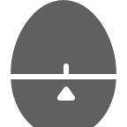

| ID | Glyph | ID | Glyph | ID | Glyph | ID | Glyph |
|----|-------|----|-------|----|-------|----|-------|
| icon_001.png |  | icon_002.png |  | icon_003.png |  | icon_004.png |  |
| icon_005.png |  | icon_006.png |  | icon_007.png |  | icon_008.png |  |
| icon_009.png |  | icon_010.png |  | icon_011.png |  | icon_012.png |  |
| icon_013.png |  | icon_014.png |  | icon_015.png |  | icon_016.png |  |
| icon_017.png |  | icon_018.png |  | icon_019.png |  | icon_020.png |  |
| icon_021.png |  | icon_022.png |  | icon_023.png |  | icon_024.png |  |
| icon_025.png |  | icon_026.png |  | icon_027.png |  | icon_028.png |  |
| icon_029.png |  | icon_030.png |  | icon_031.png |  | icon_032.png |  |
| icon_033.png |  | icon_034.png |  | icon_035.png |  | icon_036.png |  |
| icon_037.png |  | icon_038.png |  | icon_039.png |  | icon_040.png |  |
| icon_041.png |  | icon_042.png |  | icon_043.png |  | icon_044.png |  |
| icon_045.png |  | icon_046.png |  | icon_047.png |  | icon_048.png |  |
| icon_049.png |  | icon_050.png |  | icon_051.png |  | icon_052.png |  |
| icon_053.png |  | icon_054.png |  | icon_055.png |  | icon_056.png |  |
| icon_057.png |  | icon_058.png |  | icon_059.png |  | icon_060.png |  |
| icon_061.png |  | icon_062.png |  | icon_063.png |  | icon_064.png |  |
| icon_065.png |  | icon_066.png |  | icon_067.png |  | icon_068.png |  |
| icon_069.png |  | icon_070.png |  | icon_071.png |  | icon_072.png |  |
| icon_073.png |  | icon_074.png |  | icon_075.png |  | icon_076.png |  |
| icon_077.png |  | icon_078.png |  | icon_079.png |  | icon_080.png |  |
| icon_081.png |  | icon_082.png |  | icon_083.png |  | icon_084.png |  |
| icon_085.png |  | icon_086.png |  | icon_087.png |  | icon_088.png |  |
| icon_089.png |  | icon_090.png |  | icon_091.png |  | icon_092.png |  |
| icon_093.png |  | icon_094.png |  | icon_095.png |  | icon_096.png |  |
| icon_097.png |  | icon_098.png |  | icon_099.png |  | icon_100.png |  |
| icon_101.png |  | icon_102.png |  | icon_103.png |  | icon_104.png |  |
| icon_105.png |  | icon_106.png |  | icon_107.png |  | icon_108.png |  |
| icon_109.png |  | icon_110.png |  | icon_111.png |  | icon_112.png |  |
| icon_113.png |  | icon_114.png |  | icon_115.png |  | icon_116.png |  |
| icon_117.png |  | icon_118.png |  | icon_119.png |  | icon_120.png |  |
| icon_121.png |  | icon_122.png |  | icon_123.png |  | icon_124.png |  |
| icon_125.png |  | icon_126.png |  | icon_127.png |  | icon_128.png |  |
| icon_129.png |  | icon_130.png |  | icon_131.png |  | icon_132.png |  |
| icon_133.png |  | icon_134.png |  | icon_135.png |  | icon_136.png |  |
| icon_137.png |  | icon_138.png |  | icon_139.png |  | icon_140.png |  |
| icon_141.png |  | icon_142.png |  | icon_143.png |  | icon_144.png |  |
| icon_145.png |  | icon_146.png |  | icon_147.png |  | icon_148.png |  |
| icon_149.png |  | icon_150.png |  | icon_151.png |  | icon_152.png |  |
| icon_153.png |  | icon_154.png |  | icon_155.png |  | icon_156.png |  |
| icon_157.png |  | icon_158.png |  | icon_159.png |  | icon_160.png |  |
| icon_161.png |  | icon_162.png |  | icon_163.png |  | icon_164.png |  |
| icon_165.png |  | icon_166.png |  | icon_167.png |  | icon_168.png |  |
| icon_169.png |  | icon_170.png |  | icon_171.png |  | icon_172.png |  |
| icon_173.png |  | icon_174.png |  | icon_175.png |  | icon_176.png |  |
| icon_177.png |  | icon_178.png |  | icon_179.png |  | icon_180.png |  |
| icon_181.png |  | icon_182.png |  | icon_183.png |  | icon_184.png |  |
| icon_185.png |  | icon_186.png |  | icon_187.png |  | icon_188.png |  |
| icon_189.png |  | icon_190.png |  | icon_191.png |  | icon_192.png |  |
| icon_193.png |  | icon_194.png |  | icon_195.png |  | icon_196.png |  |
| icon_197.png |  | icon_198.png |  | icon_199.png |  | icon_200.png |  |
| icon_201.png |  | icon_202.png |  | icon_203.png |  | icon_204.png |  |
| icon_205.png |  | icon_206.png |  | icon_207.png |  | icon_208.png |  |
| icon_209.png |  | icon_210.png |  | icon_211.png |  | icon_212.png |  |
| icon_213.png |  | icon_214.png |  | icon_215.png |  | icon_216.png |  |
| icon_217.png |  | icon_218.png |  | icon_219.png |  | icon_220.png |  |
| icon_221.png |  | icon_222.png |  | icon_223.png |  | icon_224.png |  |
| icon_225.png |  | icon_226.png |  | icon_227.png |  | icon_228.png |  |
| icon_229.png |  | icon_230.png |  | icon_231.png |  | icon_232.png |  |
| icon_233.png |  | icon_234.png |  | icon_235.png |  | icon_236.png |  |
| icon_237.png |  | icon_238.png |  | icon_239.png |  | icon_240.png |  |
| icon_241.png |  | icon_242.png |  | icon_243.png |  | icon_244.png |  |
| icon_245.png |  | icon_246.png |  | icon_247.png |  | icon_248.png |  |
| icon_249.png |  | icon_250.png |  | icon_251.png |  | icon_252.png |  |